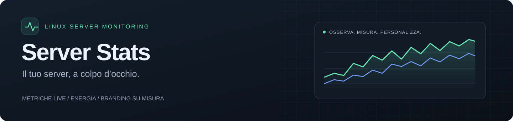
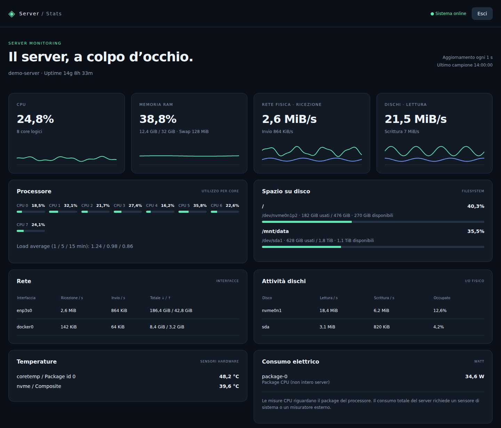
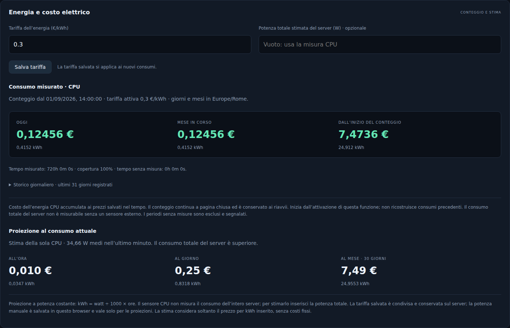

<div align="center">



**Una dashboard per capire come sta il tuo server.**<br>
CPU, memoria, rete, dischi ed energia, in un’interfaccia personalizzabile.

[](https://github.com/GioFerla/server-stats/actions/workflows/checks.yml)


[Anteprima](#anteprima) · [Avvio rapido](#avvio-rapido) · [Personalizzazione](#personalizzazione) · [Energia](#energia-e-costi) · [Documentazione tecnica](#documentazione-tecnica)

</div>

---

## Anteprima



*Screenshot dell’interfaccia reale con dati dimostrativi. Nome host, consumi e attività mostrati sono esempi, non misure del server che ospita il repository.*

### Il progetto in numeri

| ⏱ Aggiornamento | 📈 Grafici live | 🗓 Storico energetico | 📦 Dipendenze applicative |
| :---: | :---: | :---: | :---: |
| **1 secondo** | **10 minuti** | **31 giorni visibili** | **0 librerie esterne** |
| Intervallo predefinito | Finestra predefinita | Conteggio completo conservato in SQLite | Python standard library e JavaScript nativo |

Intervallo e durata dei grafici sono configurabili. Lo storico dei grafici vive in memoria; il conteggio energetico è persistente. I badge mostrano lo stack e lo stato della CI, non benchmark di prestazioni.

## Cosa puoi monitorare

| Area | Cosa mostra |
| --- | --- |
| **CPU** | Utilizzo totale e per core, load average e uptime |
| **Memoria** | RAM usata e disponibile, percentuale di utilizzo e swap |
| **Rete** | Traffico in ingresso e uscita, velocità e contatori per interfaccia |
| **Dischi** | Lettura, scrittura, occupazione I/O e spazio dei filesystem |
| **Sensori** | Temperature hardware e potenza, quando esposte dal sistema |
| **Energia** | kWh e costi della CPU, tariffa modificabile e proiezioni di spesa |

- **Il tuo branding:** nome, etichetta, titolo e colori si impostano in `.env`.
- **Login integrato:** password con hash, sessioni temporanee e limite ai tentativi di accesso.
- **Dati sul tuo server:** raccolta locale, database SQLite e nessun servizio esterno necessario al funzionamento.
- **Docker pronto:** immagine senza dipendenze frontend, healthcheck e limiti di risorse inclusi.

## Avvio rapido

**Requisiti:** host Linux, Docker Engine con Docker Compose, Python 3 per generare le credenziali e un reverse proxy HTTPS.

### 1. Scarica e configura

```sh
git clone https://github.com/GioFerla/server-stats.git
cd server-stats
cp .env.example .env
```

Se il repository è privato, serve un account GitHub autorizzato. Apri `.env` e scegli nome, colori e impostazioni. Non sovrascrivere un `.env` esistente copiando nuovamente l’esempio.

### 2. Imposta il login e avvia

```sh
python3 credentials.py --username admin
docker compose up -d --build
```

Lo script chiede e conferma una password di almeno 12 caratteri, senza mostrarla, e salva soltanto l’hash.

### 3. Collega il dominio

Integra [Caddyfile.example](Caddyfile.example) nella configurazione del tuo Caddy e sostituisci il dominio:

```caddyfile
stats.example.com {
    reverse_proxy 127.0.0.1:8091
}
```

Configura il DNS verso il server, valida e ricarica Caddy, quindi apri **`https://stats.example.com`**. Il login richiede HTTPS: il cookie di sessione ha l’attributo `Secure`.

L’esempio `.env` espone l’upstream HTTP su `127.0.0.1:8091`. Se il proxy gira in una rete Docker bridge o su un altro host, scegli un `BIND_ADDRESS` raggiungibile dal proxy; in una rete Docker condivisa il servizio è raggiungibile come `stats:80`.

## Personalizzazione

Il nome predefinito è **Server / Stats**. Non serve modificare HTML o JavaScript per adattarlo alla tua installazione:

```dotenv
STATS_NAME='Home Lab'
STATS_LABEL='Monitor'
STATS_HEADING='La tua infrastruttura, sotto controllo.'
STATS_ACCENT='#63e6b4'
STATS_SECONDARY='#729dff'
STATS_SAMPLE_SECONDS=1
STATS_HISTORY_SECONDS=600
STATS_TIMEZONE=Europe/Rome
STATS_INITIAL_PRICE=0.30
```

Nome ed etichetta compaiono nell’intestazione, nel login e nel titolo del browser. I colori si applicano anche a barre e grafici.

Dopo una modifica a `.env`, ricrea il container:

```sh
docker compose up -d
```

<details>
<summary><strong>Tutte le variabili di configurazione</strong></summary>

| Variabile | Default se omessa | Funzione |
| --- | --- | --- |
| `STATS_NAME` | `Server` | Nome dell’installazione |
| `STATS_LABEL` | `Stats` | Etichetta accanto al nome |
| `STATS_HEADING` | `Il server, a colpo d’occhio.` | Titolo della dashboard |
| `STATS_ACCENT` | `#63e6b4` | Colore principale |
| `STATS_SECONDARY` | `#729dff` | Colore invio/scrittura |
| `STATS_SAMPLE_SECONDS` | `1` | Intervallo di raccolta e aggiornamento: 0,25–10 s |
| `STATS_HISTORY_SECONDS` | `600` | Storico dei grafici in memoria: 60–3600 s |
| `STATS_TIMEZONE` | `Europe/Rome` | Fuso IANA per giorni e mesi del conteggio |
| `STATS_INITIAL_PRICE` | `0.30` | Tariffa iniziale in €/kWh: 0–100, solo per database nuovi |
| `STATS_PORT` | `8091` | Porta HTTP pubblicata da Compose |
| `BIND_ADDRESS` | `0.0.0.0` | Indirizzo di ascolto; `.env.example` usa `127.0.0.1` |
| `STATS_USERNAME` | `admin` | Nome utente del login |
| `STATS_PASSWORD_HASH` | vuoto | Hash generato da `credentials.py`, obbligatorio |
| `HOST_PROC` | `/host/proc` | Percorso dei contatori Linux |
| `HOST_SYS` | `/host/sys` | Percorso di dispositivi e sensori |
| `HOST_ROOT` | `/host/root` | Root host per hostname e spazio dei filesystem |
| `ENERGY_DB` | `/data/energy.sqlite3` | Percorso del database persistente |

Per testi e colori usa apici singoli, come nell’esempio. I campi di testo accettano 1–200 caratteri senza caratteri di controllo; i colori richiedono il formato `#RRGGBB`. Le impostazioni non valide impediscono l’avvio. L’interfaccia è in italiano e la valuta è EUR.

Scegli il fuso prima di iniziare il conteggio: modificarlo non converte i giorni già aggregati. `STATS_INITIAL_PRICE` non sovrascrive una tariffa già salvata; usa **Salva tariffa** dalla dashboard.

I percorsi `HOST_*` e `ENERGY_DB` sono utili per esecuzioni personalizzate: cambiandoli occorre adeguare anche i mount Docker. Fuori da Docker il server legge le variabili d’ambiente e non carica autonomamente `.env`.

</details>

## Energia e costi



*Anteprima con dati dimostrativi; la disponibilità delle misure dipende dai sensori dell’host.*

### Conteggio misurato

Il backend usa i contatori **RAPL dei package CPU** per accumulare energia e costo di oggi, del mese e dall’inizio del conteggio. Mostra gli ultimi 31 giorni registrati, il tempo misurato e la copertura delle misure.

La tariffa si salva con **Salva tariffa** e si applica ai nuovi intervalli: i costi passati restano invariati. Il database vive nel volume Docker `stats-data`, quindi il conteggio continua a browser chiuso e sopravvive a riavvii e ricreazioni del container.

**I consumi CPU non rappresentano il consumo totale del server.** Per misurare tutto il sistema serve un sensore adeguato o un misuratore alla presa. I periodi senza letture, gli arresti e gli intervalli superiori a 30 secondi non generano consumi ipotetici; sono segnalati come non misurati. Non si ricostruiscono consumi precedenti all’attivazione.

### Proiezione di spesa

La proiezione usa la potenza CPU media dell’ultimo minuto oppure la potenza totale che inserisci manualmente:

```text
energia (kWh) = potenza (W) ÷ 1000 × ore
costo (€)     = energia (kWh) × tariffa (€/kWh)
```

Esempio: **100 W × 24 ore = 2,4 kWh → 0,72 € a 0,30 €/kWh**. È una proiezione a potenza costante, senza quote fisse. Il mese stimato vale 30 giorni. La potenza manuale si salva nel browser e riguarda soltanto le proiezioni.

## Documentazione tecnica

<details>
<summary><strong>Fonti delle metriche e limiti</strong></summary>

Il container legge `/proc`, `/sys` e i filesystem host tramite mount in sola lettura. Non usa il socket Docker né la modalità `privileged`. CPU e RAM sono quelle dell’host; la rete viene letta da `/proc/1/net/dev`.

- Il riepilogo rete somma le interfacce fisiche; la tabella include anche quelle virtuali.
- L’I/O aggregato considera i dispositivi fisici ed esclude partizioni, loop e device mapper per evitare doppio conteggio.
- Lo spazio percentuale considera quello disponibile agli utenti, escludendo i blocchi riservati.
- Il primo campione dei contatori vale zero perché manca un intervallo di confronto.
- Temperature e watt dipendono dai sensori leggibili; se mancano vengono indicati come non disponibili.
- I watt RAPL derivano dalla differenza di `energy_uj`, gestendo il wrap; le zone figlie non vengono sommate e non si usano stime da TDP.

Il conteggio usa `1 kWh = 3.600.000.000.000 microjoule` e ripartisce gli intervalli che attraversano mezzanotte tra i due giorni. I confini di giorno e mese rispettano il fuso configurato, inclusa l’ora legale.

Riferimento tecnico: [Linux power capping framework](https://www.kernel.org/doc/html/latest/power/powercap/powercap.html).

</details>

<details>
<summary><strong>Autenticazione e credenziali</strong></summary>

Dashboard e API delle metriche richiedono il login. Sono pubblici soltanto pagina di accesso, relativi asset, tema e `/health`.

Le password sono conservate come hash **PBKDF2-SHA256 con 600.000 iterazioni**. Il cookie è `Secure`, `HttpOnly` e `SameSite=Strict`; le sessioni durano 12 ore e si invalidano al logout o al riavvio. Il backend limita il login a 20 richieste al minuto.

Per cambiare le credenziali:

```sh
python3 credentials.py --username admin
docker compose up -d
```

Lo script preserva le altre impostazioni in `.env` ed elimina l’eventuale file locale `accesso.txt`. `.env`, credenziali, cache e database sono esclusi da Git; `.dockerignore` ammette solo codice e asset applicativi.

</details>

<details>
<summary><strong>Operazioni, persistenza e limiti Docker</strong></summary>

```sh
docker compose ps
docker compose logs --tail=50
curl http://127.0.0.1:8091/health
```

`/health` restituisce `200` se i campioni sono recenti, altrimenti `503`. `/api/stats` richiede una sessione autenticata.

Compose include riavvio automatico, filesystem del container in sola lettura, capability rimosse, `no-new-privileges`, rotazione dei log e questi limiti:

| Risorsa | Limite configurato |
| --- | --- |
| Memoria | 128 MiB |
| CPU | 0,5 CPU |
| Processi | 64 |
| Log | 2 file da 5 MB |

Sono **limiti del container**, non misure di consumo effettivo.

I dati energetici sono nel volume `stats-data`, montato su `/data`. Per mantenere lo storico **non usare `docker compose down -v`**. I grafici live, invece, si azzerano al riavvio.

GitHub ospita il codice: il servizio si esegue sul proprio host Linux. GitHub Pages non esegue questo backend.

</details>

## Struttura del progetto

```text
server-stats/
├── config.py           # Impostazioni e validazione
├── metrics.py          # Raccolta metriche Linux
├── server.py           # HTTP, API e rendering delle pagine
├── auth.py             # Sessioni e login
├── credentials.py      # Generazione delle credenziali
├── energy_store.py     # Conteggio energetico e SQLite
├── static/             # HTML, CSS e JavaScript
├── docs/assets/        # Banner e anteprime del README
├── test_*.py           # Test di configurazione, login ed energia
├── compose.yaml        # Deploy Docker
└── .env.example        # Configurazione iniziale
```

## Verifiche

La suite comprende **16 test** per configurazione, escaping del branding, autenticazione, tariffa iniziale, persistenza, wrap dei contatori, intervalli non misurati e passaggi di giorno, mese e ora legale.

```sh
python3 -m unittest discover -v
node --check static/app.js
node --check static/energy.js
node --check static/login.js
```

[GitHub Actions](https://github.com/GioFerla/server-stats/actions/workflows/checks.yml) esegue i test Python, controlla la sintassi JavaScript e costruisce l’immagine Docker a ogni push e pull request.
